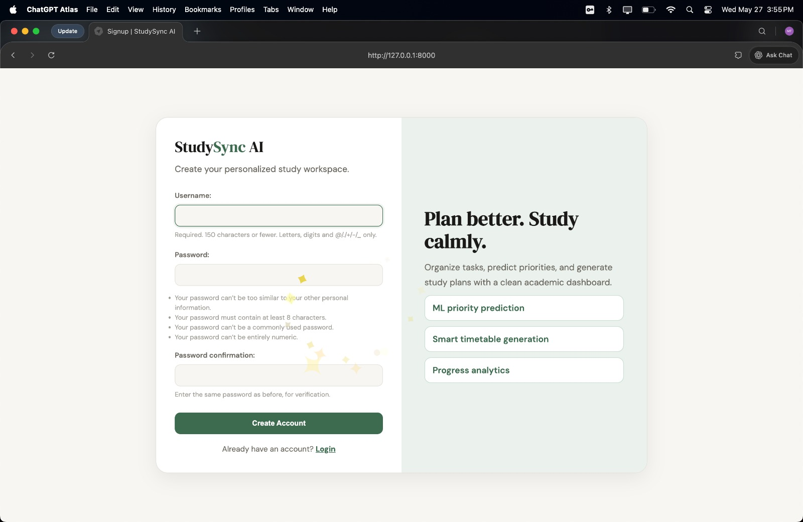
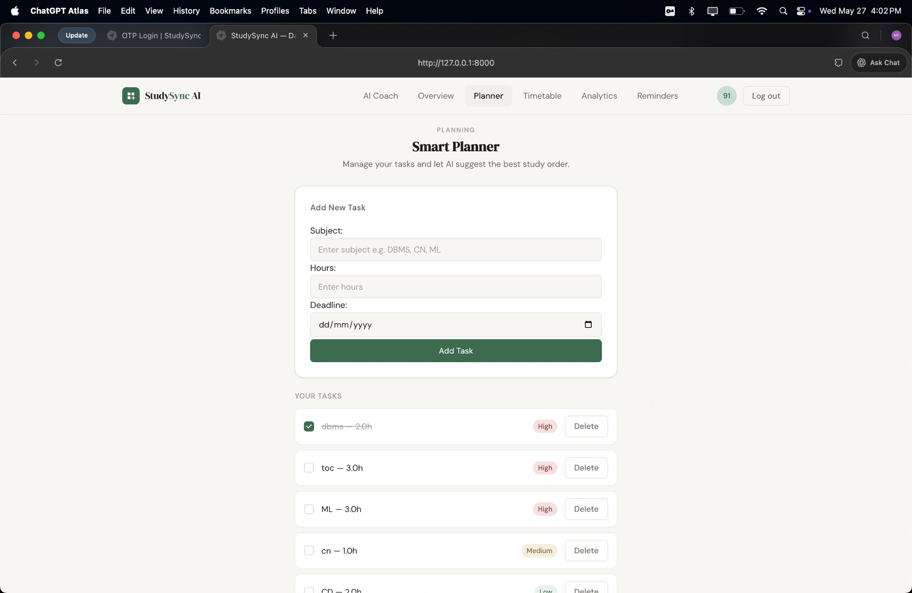
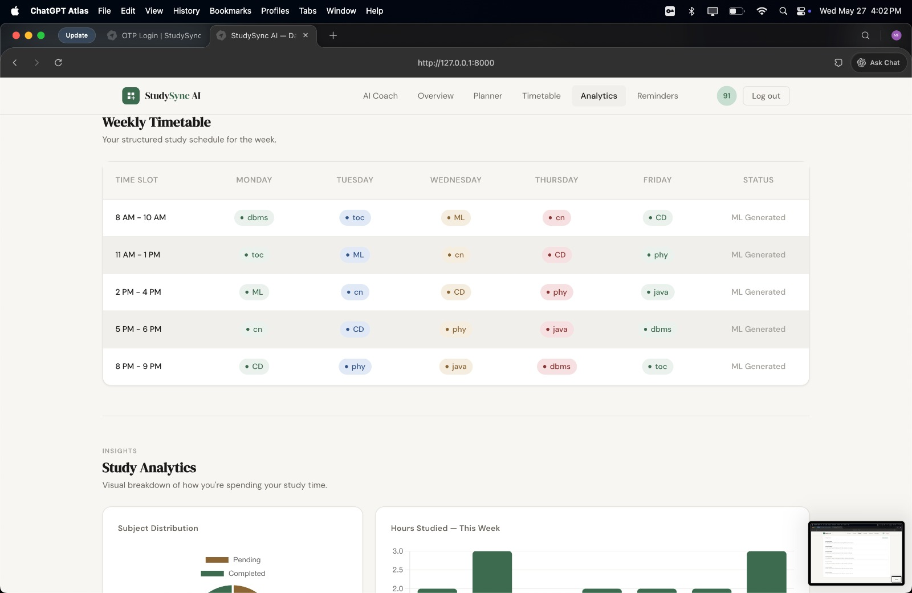
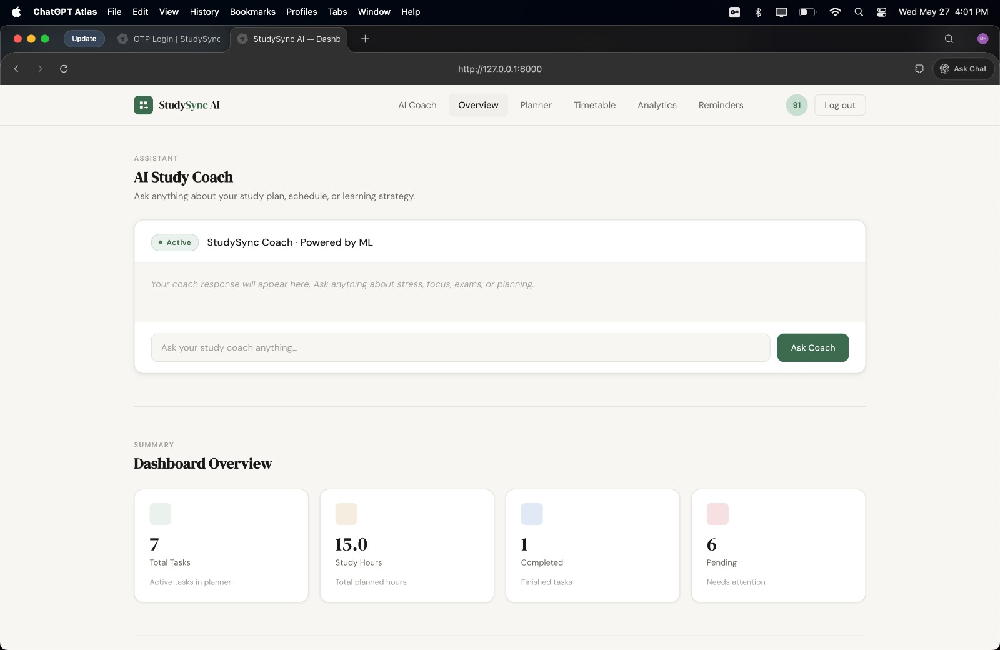
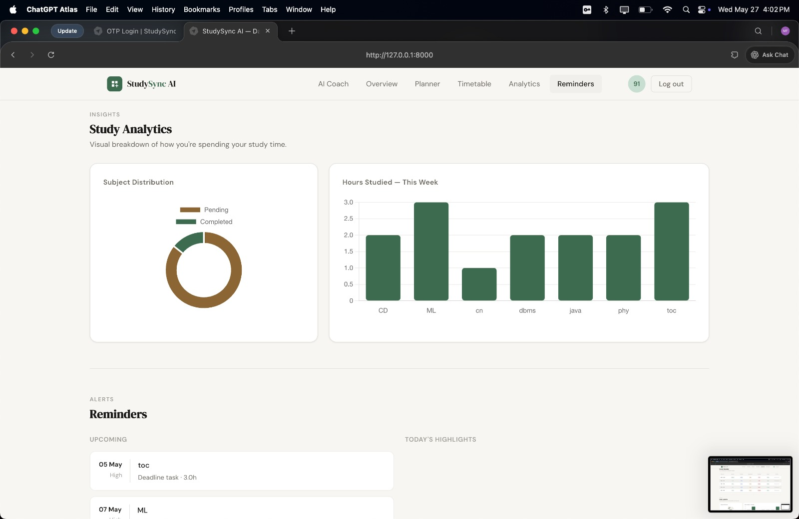

<h1 align="center">StudySync AI</h1>

<h3 align="center">Your AI-Powered Learning Companion</h3>

<p align="center">
  
</p>

<p align="center">
  
  
  
</p>

<p align="center">
  
  
  
  
  
  
</p>

---

## Overview

**StudySync AI** is an AI-powered academic productivity website designed to help students manage tasks, plan studies, track progress, and access intelligent learning support from one centralized platform.

> **Learn Smarter. Stay Organized. Achieve More.**

---

## Problem Statement

Students often handle notes, assignments, deadlines, study plans, and learning resources across different platforms. This scattered workflow leads to poor organization, missed tasks, reduced productivity, and ineffective study habits.

---

## Solution

StudySync AI brings academic planning, productivity tracking, task management, analytics, and AI-based study support into one clean web platform.

It helps students:

- Organize academic tasks
- Plan study schedules
- Track learning progress
- Access AI-powered assistance
- Improve focus and consistency
- Reduce academic stress

---

## Platform Preview

<p align="center">
  
  
</p>

<p align="center">
  
  
</p>

<p align="center">
  
</p>

---

## Key Features

| Feature | Description |
|---|---|
| AI Study Assistant | Provides smart academic help, explanations, and learning support |
| Task Management | Helps students create, manage, and complete academic tasks |
| Study Planner | Organizes study schedules and learning goals |
| Analytics Dashboard | Tracks progress and productivity visually |
| User Authentication | Allows users to sign up and access their personalized workspace |
| Centralized Learning Space | Keeps academic activities organized in one platform |

---

## How It Works

```text
Student Login
      ↓
Task & Study Input
      ↓
AI Assistance
      ↓
Progress Tracking
      ↓
Smarter Learning Decisions
